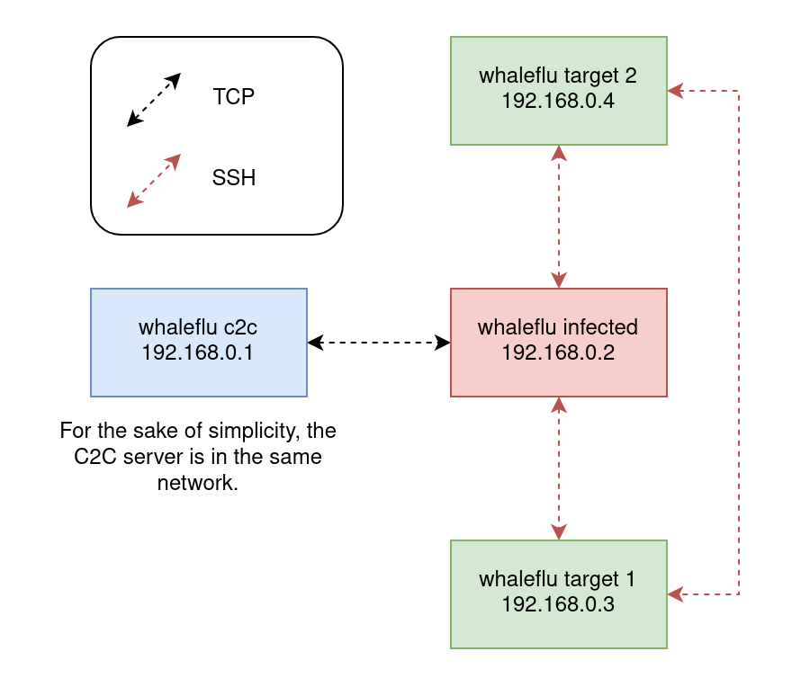

# whaleflu
Whaleflu is a dumb malware I'm developing for fun. Strictly for educational purposes.

The malware attempts to detect instances in the network and multiply itself over discovered instances.

## Starting Scenarion & Goal
  
The starting scenario is that the malware has already infected one machine in the network (marked with red) and it's calling back home (marked with blue). Communicataion happens over simple Python scripts [whaleflu_c2c.py](whaleflu_c2c.py) and [whaleflu.py](whaleflu.py)

Whaleflu attempts to collect information about the infected host and send them back to the C2C server. It also pings the C2C server every once in a set period.

After sending the host information, it will attempt to copy itself over to other machines in the network via `ssh` using common unsecure credentials. If copying was successful, whaleflu will execute the previous steps until it cannot copy itself further.

## Environment
The sandbox environment consists of multiple Ubuntu Docker containers, connected via Docker network.

The environment is supposed to simulate a typical unsecure environment where each machine allows `root` login via ssh. The ssh credentials are `root:root` for all instances.

### Requirements
- [Docker Engine](https://docs.docker.com/engine/install/ubuntu/)

## Running the virtual environment
Build the containers all at once via:
```sh
$ chmod +x build_containers.sh
$ ./build_containers.sh
```
or build them individually:  
- Build the infected container from Dockerfile: `$ docker build -t whaleflu_infected . --target=infected`
- Build the non-infected container from Dockerfile: `$ docker build -t whaleflu_base . --target=whaleflu_base`
- Build the C2C contaier from Dockerfile: `$ docker build -t whaleflu_c2c . --target=c2c`

After the Docker images have been build:
- Start the environment: `$ docker compose up --detach`
- You can enter the individual containers by first getting the container ID via `$ docker ps` and then running: `$ docker exec -it [<Container ID>] bash`

The container based on images `whaleflu_c2c` and `whaleflu_infected` have scripts `whaleflu_c2c.py` and `whaleflu.py`, respectively. You can enter each container via `$ docker exec -it [<Container ID>] bash` and execute the scripts via `$ python3 [<whaleflu_c2c.py || whaleflu.py>]`. The containers use these scripts to communicate with each other, you can think of it as the malware is calling back home. Simply put `whaleflu_c2c.py` is the C2C server, `whaleflu.py` is the client.

When `whaleflu.py` is executed, it will attempt to collect information about the host and it back home. Then, it will attempt to brute force connections over `ssh`. If successful, the `whaleflu.py` is copied over to the other machine and executed.
